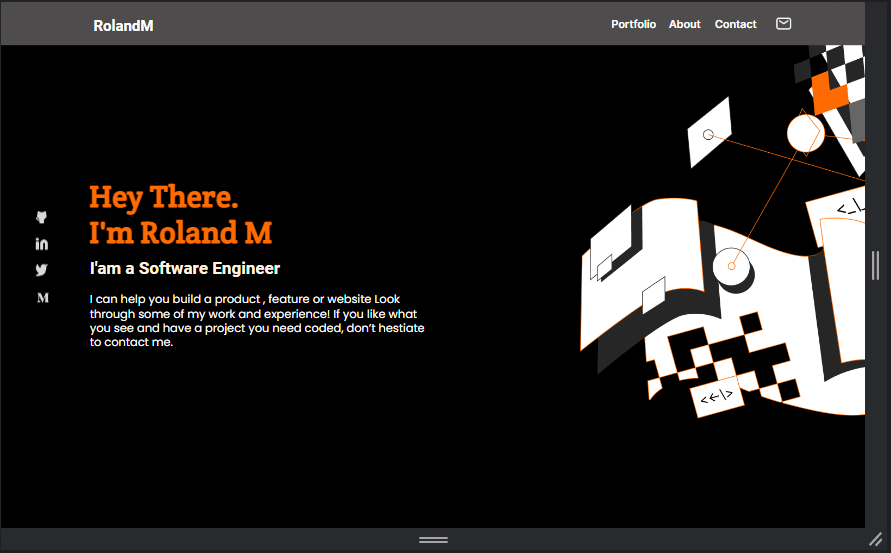

# My Portfolio
> This is my first version of my portfolio create from microverse.
This project was build with HTML/CSS and some basics of JavaScript.
## 1. Mobile phone View: 

## 2. Desktop View:

This is a simple Portfolio that i built based on Microverse Portfolio's Figma design using css.

## Built With

- Major languages: HTML / CSS
- Technologies used : GIT / GITHUB / LINTERS 

## Live Demo

[Live Demo Link](https://rolandm99.github.io/My-personal-portfolio/)

## Getting Started

To get a local copy up and running follow these simple example steps.

### Prerequisites : Knowloge about html,css flexbox, Git, Github and linter

1. First clone the project $ git clone https://github.com/RolandM99/My-portfolio.git
2. Then open index.html in your browser
3. [optional] You can even fork the project

## Authors

👤 **Roland Manful Mweze**

- GitHub: [Rolandm99](https://github.com/RolandM99)
- Twitter: [@Manfulmwez](https://twitter.com/ManfulMwez)
- LinkedIn: [Roland N. MWEZE](https://www.linkedin.com/in/roland-n-mweze-8b1045189/)

## 🤝 Contributing

👤 **Ishmael Kargbo**

- GitHub: [@ishmaelkargbo](https://github.com/ishmaelkargbo)
- Twitter: [@IshoKargbo](https://twitter.com/IshoKargbo)
- LinkedIn: [LinkedIn](https://linkedin.com/in/ishmael-kargbo-9a986a214)

Contributions, issues, and feature requests are welcome!

Feel free to check the [issues page](../../issues/).

## Show your support

Give a ⭐️ if you like this project!

## Acknowledgments

- Thanks to Microverse
- Thanks to my code partners and mostly my stand Up team for each form of motiations they give me daily

## 📝 License

This project is [MIT](./MIT.md) licensed.
