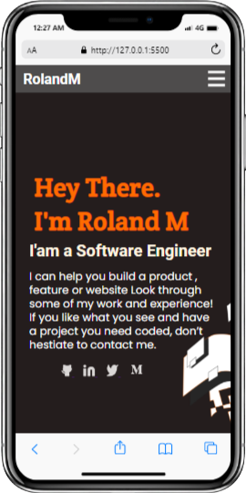

# My Portfolio
> This repo contains the first version of my personal portfolio create from microverse.
## 1. Mobile phone View: 

This is a simple portfolio that i built based on Microverse Portfolio's Figma design using css.

## Built With

- Major languages: HTML / CSS
- Frameworks
- Technologies used : GIT / GITHUB / LINTERS 

## Live Demo

[Live Demo Link](https://livedemo.com)

## Getting Started

**This is an example of how you may give instructions on setting up your project locally.**
**Modify this file to match your project, remove sections that don't apply. For example: delete the testing section if the currect project doesn't require testing.**

To get a local copy up and running follow these simple example steps.

### Prerequisites : Knowloge about html,css flexbox, Git, Github and linter

1. First clone the project $ git clone https://github.com/RolandM99/My-portfolio.git
2. Then open index.html in your browser
3. [optional] You can even fork the project

## Authors

👤 **Roland Manful Mweze**

- GitHub: [Rolandm99](https://github.com/RolandM99)
- Twitter: [@Manfulmwez](https://twitter.com/ManfulMwez)
- LinkedIn: [Roland N. MWEZE](https://www.linkedin.com/in/roland-n-mweze-8b1045189/)

## 🤝 Contributing

Contributions, issues, and feature requests are welcome!

Feel free to check the [issues page](../../issues/).

## Show your support

Give a ⭐️ if you like this project!

## Acknowledgments

- Hat tip to anyone whose code was used
- Inspiration
- etc

## 📝 License

This project is [MIT](./MIT.md) licensed.
